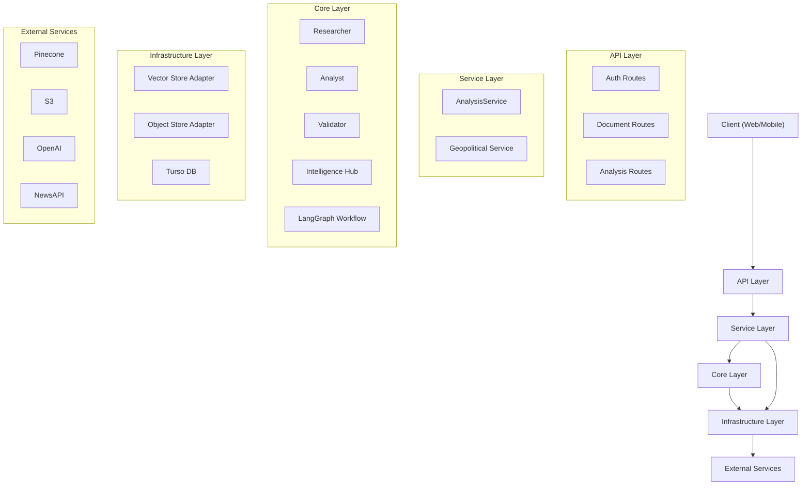

# LedgerLens Architecture

## Overview

LedgerLens is a multi-agent financial analysis platform built with a modular, layered architecture. This design promotes separation of concerns, testability, and scalability.

## High-Level Structure

The application is structured into four main layers:

1.  **API Layer (`src/api`)**: Handles HTTP requests, authentication, and routing.
2.  **Service Layer (`src/core/services`)**: Orchestrates business logic and workflows.
3.  **Core Layer (`src/core`)**: Contains the intelligent agents and workflow definitions.
4.  **Infrastructure Layer (`src/infrastructure`)**: Manages external resources like storage and databases.
5.  **Domain Layer (`src/domain`)**: Defines data entities and schemas shared across layers.

## Component Diagram

## Key Components

### 1. Agents (`src/core/agents`)
- **Researcher**: Retrieves relevant context from documents using vector search.
- **Analyst**: Synthesizes information to answer user questions.
- **Validator**: Verifies the analyst's answer against the source context.
- **IntelligenceHub**: Generates structured insights and risk assessments.

### 2. Workflows (`src/core/workflows`)
- **FinancialAnalysisWorkflow**: A minimal cyclic graph (LangGraph) that coordinates the agents. It handles the flow from research -> analysis -> validation, with feedback loops for fetching more information if validation fails.

### 3. Storage (`src/infrastructure/storage`)
- **VectorStore**: Abstract interface for vector databases. Currently implemented with Pinecone.
- **ObjectStore**: Abstract interface for file storage. Currently implemented with AWS S3.

### 4. Domain (`src/domain`)
- **Entities**: Core business objects (User, Document).
- **Schemas**: Pydantic models for API request/response validation.

## Design Patterns

- **Dependency Injection**: Services and storage adapters are injected into routes and other services, improving testability.
- **Repository/Adapter Pattern**: Infrastructure concerns are hidden behind abstract interfaces (`VectorStore`, `ObjectStore`).
- **State Management**: LangGraph state is used to pass context and data between agents in a workflow.
